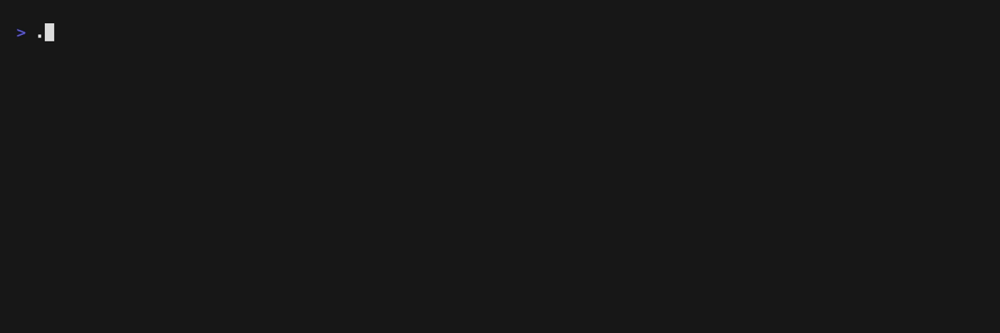

# SLog (Sh*tty Logging)

>! NOTE
> SLog is currently working on *Nix systems (Linux, macOS).

**SLog** is a minimal C logging library with color-coded output, multiple
verbosity levels, and support for logging to stdout, stderr, files, and custom
destinations.



## Installation
```shell
$ git clone https://github.com/LanaMirko04/libslog.git
$ git checkout v2.x.x # replace with the latest version
$ cd slog
$ make
$ sudo make install
```

or

Copy files in src directory to your project

```
.
├── ...
├── src
│   ├── main.c
│   ├── slog.c
│   └── slog.h
└── ...
```

## Usage
Include the SLog header in your C source file:

```c
#include <slog.h>

int main() {
    struct SlogConfig config = {
        .default_logger = SLOG_INIT_DEFAULT_LOGGER,
        .enter_cs = NULL,
        .exit_cs = NULL,
    };
    slog_init(&config);
    
    /*! Print and informational message */
    SLOG_INFO("Hello, SLog!");
    
    return 0;
}
```

## API Reference
For detailed information about the API, see [API.md](./docs/API.md).

## License
SLog is licensed under the [MIT](LICENSE) License.
